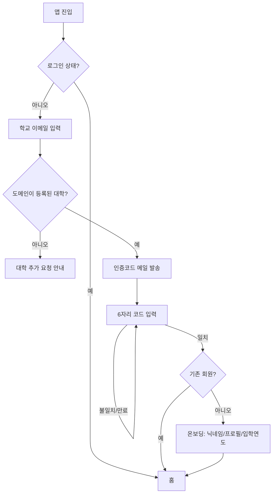
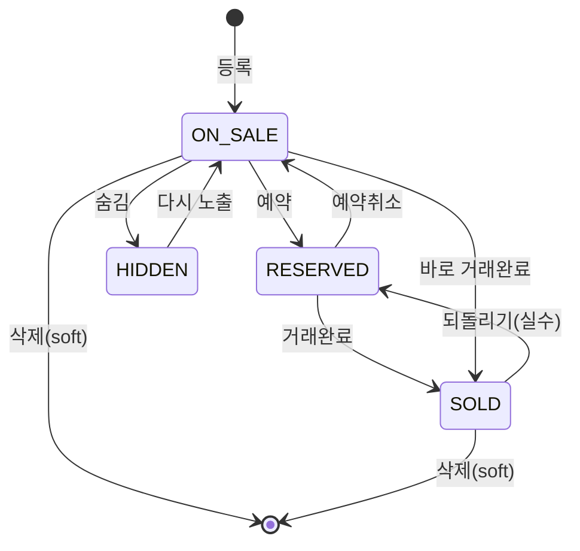
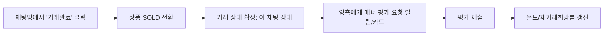
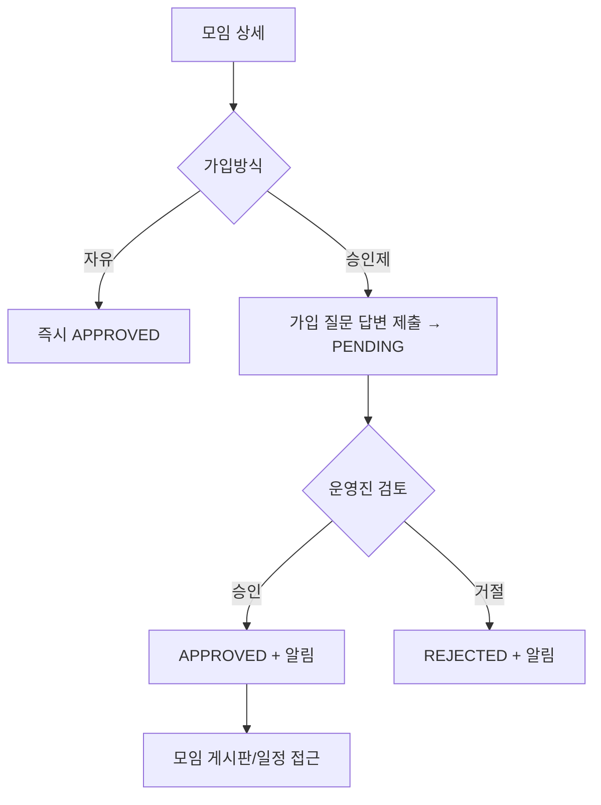
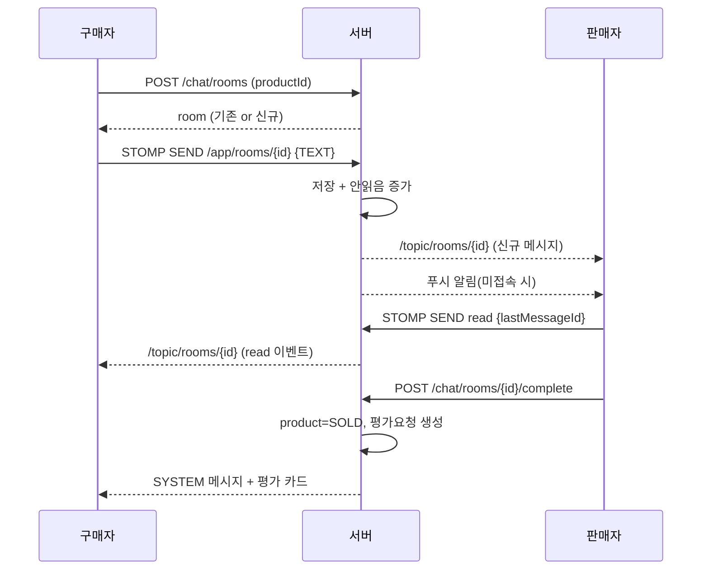

# 02. 기능 명세 — 당타(DangTa)

> 표기 규칙: **[필수]** = v1 릴리스 포함 / **[선택]** = v1 목표이나 후순위 가능 / 상태값은 `UPPER_SNAKE`

목차
1. 공통 규칙
2. 인증 / 온보딩
3. 프로필 / 매너온도
4. 중고거래
5. 중고책
6. 소모임
7. 커뮤니티
8. 채팅
9. 시간표
10. 알림
11. 신고 / 차단 / 제재
12. 검색
13. 관리자

---

## 1. 공통 규칙

- 모든 콘텐츠(상품·책·글·모임)는 **작성자 대학(university_id)에 귀속**된다. 기본 노출 범위 = 같은 대학.
- 비인증(이메일 미인증) 사용자는 **읽기도 불가** — 온보딩 전에는 진입 자체가 막힘.
- 삭제는 원칙적으로 **soft delete** (`deleted_at`). 신고·분쟁 대비 로그 보존.
- 이미지 업로드: 클라이언트가 presigned URL 요청 → S3 직접 업로드 → 업로드된 key를 본문 생성 API에 전달.
- 목록 API는 **커서 기반 페이지네이션** (정렬 키 + id). 무한 스크롤.
- 작성/수정/삭제는 본인 또는 관리자만. 권한 위반 시 `403`.
- Rate limit: 글/댓글/채팅 메시지 작성에 사용자별 분당 상한.

---

## 2. 인증 / 온보딩

### 2.1 기능 목록

| ID | 기능 | 필수 | 설명 |
|---|---|---|---|
| AUTH-1 | 학교 이메일 인증코드 발송 | [필수] | 이메일 입력 → 도메인으로 대학 매칭 → 6자리 코드 메일 발송 (유효 5분, 재발송 60초 쿨다운, 시도 5회 제한) |
| AUTH-2 | 인증코드 검증 & 계정 생성/로그인 | [필수] | 코드 일치 시: 신규면 계정 생성(온보딩으로), 기존이면 로그인 |
| AUTH-3 | 세션/토큰 발급 | [필수] | Access(짧음) + Refresh(김, httpOnly 쿠키). 자세히는 05 문서 |
| AUTH-4 | 온보딩 프로필 설정 | [필수] | 닉네임(학교 내 유니크), 프로필 이미지(선택), 입학연도, 학과(선택), 재학상태 |
| AUTH-5 | 로그아웃 / 전체 로그아웃 | [필수] | Refresh 토큰 무효화 |
| AUTH-6 | 재인증 | [필수] | 마지막 인증 후 N개월(예: 12) 경과 시 활동 제한 + 재인증 유도 |
| AUTH-7 | 회원 탈퇴 | [필수] | 개인정보 파기, 콘텐츠는 익명화 처리 후 보존 여부 정책에 따름 |
| AUTH-8 | 이메일 도메인 → 대학 관리 | [필수] | 관리자가 `university` ↔ 도메인 매핑 관리. 미등록 도메인은 "대학 추가 요청" 안내 |

### 2.2 상태

`user.status`: `PENDING_ONBOARDING` → `ACTIVE` → (`SUSPENDED` | `WITHDRAWN` | `DORMANT`)

### 2.3 플로우



---

## 3. 프로필 / 매너온도

### 3.1 프로필

| ID | 기능 | 필수 | 설명 |
|---|---|---|---|
| PROF-1 | 내 프로필 조회/수정 | [필수] | 닉네임, 이미지, 학과, 입학연도, 한 줄 소개 |
| PROF-2 | 타인 프로필 조회 | [필수] | 닉네임/이미지/매너온도/재거래희망률/판매중 목록/받은 후기 |
| PROF-3 | 닉네임 변경 제한 | [선택] | 30일 1회 등 |
| PROF-4 | 활동 배지 | [선택] | 첫 거래, 매너왕, 모임장 등 |

### 3.2 매너온도

| ID | 기능 | 필수 | 설명 |
|---|---|---|---|
| TEMP-1 | 초기 온도 부여 | [필수] | 가입 시 `36.5` |
| TEMP-2 | 거래 후 상호 평가 | [필수] | `거래완료` 후 양측에게 평가 요청. 24~72시간 내 작성 유도 |
| TEMP-3 | 평가 항목 | [필수] | 긍정 항목(친절함/시간약속/좋은상품/응답빠름) 다중선택, 부정 항목(노쇼/불친절/상품상이), 자유 후기(선택), "다시 거래하고 싶어요" Y/N |
| TEMP-4 | 온도 산정 로직 | [필수] | 아래 §3.3 |
| TEMP-5 | 재거래희망률 | [필수] | (긍정 재거래 응답 수 / 전체 평가 수) |
| TEMP-6 | 받은 후기 목록 | [필수] | 프로필에 최근 후기 노출(자유 후기 텍스트) |
| TEMP-7 | 매너온도 배지 색상 | [필수] | 구간별 색 (06 디자인 문서 스펙트럼) |

### 3.3 온도 산정 로직 (v1 규칙, 조정 가능)

```
평가 1건의 delta 계산:
  base = 0
  + 긍정 항목 개수 × +0.1  (최대 +0.4)
  + "다시 거래" = Y 이면 +0.2
  - 부정 항목 개수 × -0.5
  - 신고 접수 & 인정 시 -1.0 (별도)

온도 갱신:
  new_temp = clamp(cur_temp + delta, 0.0, 99.0)
  단, 상승은 하루 최대 +1.0 로 캡 (어뷰징 방지)
  30일 이상 평가 없으면 36.5 방향으로 매우 천천히 회귀(월 -0.1) — [선택]
```

- 동일 상대와의 반복 거래는 **주 1회만** 온도에 반영.
- 자기 자신/미인증 계정 평가 불가.

---

## 4. 중고거래

### 4.1 기능 목록

| ID | 기능 | 필수 | 설명 |
|---|---|---|---|
| PROD-1 | 상품 등록 | [필수] | 사진 1~10장, 제목, 카테고리, 가격(또는 나눔=0), 설명, 캠퍼스 위치 태그, 거래방식(직거래/택배) |
| PROD-2 | 상품 수정/삭제 | [필수] | 본인만 |
| PROD-3 | 상품 목록(피드) | [필수] | 같은 대학, 정렬: 최신순/인기순/가격, 카테고리 칩 필터, 가격 범위, 캠퍼스 필터, 거래가능만 |
| PROD-4 | 상품 상세 | [필수] | 이미지 캐러셀, 판매자 요약(매너온도), 가격, 설명, 조회수·찜수, 채팅수, 같은 판매자의 다른 물건 |
| PROD-5 | 찜하기/취소 | [필수] | 찜 목록에서 모아보기, 가격 인하 시 알림 |
| PROD-6 | 끌올 | [필수] | 마지막 끌올/등록 후 일정 시간(예: 24h) 경과해야 가능. `bumped_at` 갱신 |
| PROD-7 | 거래 상태 변경 | [필수] | `ON_SALE` → `RESERVED` → `SOLD` (되돌리기 가능). 예약중일 때 예약 상대 지정(선택) |
| PROD-8 | 조회수 집계 | [필수] | 중복 방지(유저·IP·시간 윈도우) |
| PROD-9 | 신고 | [필수] | §11 |
| PROD-10 | 카테고리 관리 | [필수] | 관리자. (디지털기기/생활가전/가구/의류/도서→중고책탭연동/뷰티/스포츠/티켓·기프티콘/무료나눔/기타) |
| PROD-11 | 가격 제안 | [선택] | 채팅 내 가격 제안 버튼 |

### 4.2 상태 머신



### 4.3 거래 완료 → 평가 플로우



---

## 5. 중고책

> 중고책은 중고거래와 유사하나 **도서 마스터(book)** + **강의 태그(course)**가 핵심 차별점.

### 5.1 기능 목록

| ID | 기능 | 필수 | 설명 |
|---|---|---|---|
| BOOK-1 | 도서 검색 | [필수] | ISBN / 제목 / 저자로 도서 마스터 검색. 외부 도서 API 연동 또는 수기 등록 |
| BOOK-2 | 책 매물 등록 | [필수] | 도서 선택(또는 신규 도서 입력) + 상태(상/중/하 또는 필기유무), 가격, 사진, 강의 태그(선택), 캠퍼스 위치 |
| BOOK-3 | 정가 대비 할인율 표시 | [필수] | `(정가 - 판매가) / 정가` 뱃지 |
| BOOK-4 | 책 피드/필터 | [필수] | 전공/단과대, 학년, 강의명, 상태, 가격. 정렬: 최신/할인율/가격 |
| BOOK-5 | 강의로 교재 찾기 | [필수] | 강의 마스터 상세 → 해당 강의 태그가 붙은 책 매물 목록 |
| BOOK-6 | 시간표 연동 | [선택] | 내 시간표의 강의 → "이 강의 교재 보기" 딥링크 |
| BOOK-7 | 상태 변경 / 끌올 / 찜 / 채팅 / 신고 | [필수] | 중고거래와 동일 규칙 재사용 |
| BOOK-8 | 되팔기 | [선택] | 구매 완료한 책 → "되팔기" 시 도서 정보 자동 채움 |

### 5.2 도서 마스터 vs 매물

- `book` (마스터): ISBN(unique), 제목, 저자, 출판사, 정가, 표지 URL. 여러 매물이 공유.
- `book_listing` (매물): 판매자, 가격, 상태, 사진, 강의 태그, 거래상태. `product`와 유사 구조.
- 신규 도서 등록 시 중복 방지: ISBN 있으면 upsert, 없으면 관리자 검수 큐(선택).

---

## 6. 소모임

### 6.1 기능 목록

| ID | 기능 | 필수 | 설명 |
|---|---|---|---|
| GRP-1 | 모임 개설 | [필수] | 이름, 카테고리, 소개, 대표 이미지, 정원, 가입방식(자유/승인제), 공개여부, 가입 질문(선택) |
| GRP-2 | 모임 목록/탐색 | [필수] | 카테고리(운동/스터디/취미/봉사/친목/공모전 등), 정렬(활동순/신규/멤버수), 검색 |
| GRP-3 | 모임 상세 | [필수] | 소개, 멤버 수/목록, 최근 게시글, 다가오는 일정, 가입 버튼 |
| GRP-4 | 가입 신청/승인 | [필수] | 승인제: 신청(답변 작성) → 모임장/운영진 승인·거절. 자유: 즉시 가입 |
| GRP-5 | 멤버 역할 | [필수] | `OWNER` / `MANAGER` / `MEMBER`. 위임·강퇴·차단 |
| GRP-6 | 모임 게시판 | [필수] | 글/댓글, 공지 고정, 멤버 전용 (비멤버는 소개까지만) |
| GRP-7 | 모임 일정 | [필수] | 일정 생성(제목/일시/장소/정원), 참석/불참 응답 |
| GRP-8 | 모임 채팅 | [선택] | 그룹 채팅방 (v1은 게시판+일정으로 대체 가능) |
| GRP-9 | 모임 탈퇴 / 해산 | [필수] | OWNER 해산 시 멤버 알림, 콘텐츠 soft delete |
| GRP-10 | 모임 신고 | [필수] | §11 |

### 6.2 가입 상태

`group_member.status`: `PENDING` → (`APPROVED` | `REJECTED`) ; `APPROVED` → `LEFT` / `KICKED`



---

## 7. 커뮤니티

### 7.1 기능 목록

| ID | 기능 | 필수 | 설명 |
|---|---|---|---|
| COMM-1 | 게시판 목록 | [필수] | 학교별 기본 게시판 세트 + 관리자 추가. 예: 자유/정보공유/질문/새내기/졸업생·취준/연애/분실물/장터공지 |
| COMM-2 | 게시글 목록 | [필수] | 게시판별, 정렬(최신/인기), 검색, 이미지 썸네일, 좋아요·댓글 수 |
| COMM-3 | 게시글 작성/수정/삭제 | [필수] | 제목, 본문, 이미지 0~10, 게시판 선택, **익명 토글**, 투표 첨부(선택) |
| COMM-4 | 게시글 상세 | [필수] | 본문, 작성자(또는 익명), 좋아요, 스크랩, 댓글 트리 |
| COMM-5 | 댓글 / 대댓글 | [필수] | 1단계 대댓글, 익명(글 내 익명번호 유지), 좋아요, 삭제 |
| COMM-6 | 익명 처리 | [필수] | 글마다 작성자에게 `익명(글쓴이)`, 그 외 참여자에게 `익명1, 익명2…` 순번 부여 (글 스코프 고정) |
| COMM-7 | 좋아요 / 스크랩 | [필수] | 토글, 스크랩은 마이에서 모아보기 |
| COMM-8 | 핫게시판 | [필수] | 최근 24h 내 (좋아요×w1 + 댓글×w2) ≥ 임계치 → HOT 등록, 별도 탭 |
| COMM-9 | 투표 | [선택] | 단일/복수 선택, 마감시간, 결과 공개 시점 |
| COMM-10 | 인기 게시판/실시간 | [선택] | 학교 홈 위젯 |
| COMM-11 | 신고 / 블라인드 | [필수] | 신고 누적 시 자동 블라인드 + 관리자 확인 |

### 7.2 익명번호 규칙

- `post_id` 기준으로 `(post_id, user_id) → anon_no` 매핑 테이블.
- 글쓴이는 항상 `anon_no = 0` (표기: "익명(글쓴이)").
- 댓글 작성 순서대로 1, 2, 3… 부여. 재등장 시 같은 번호 유지.

---

## 8. 채팅

### 8.1 기능 목록

| ID | 기능 | 필수 | 설명 |
|---|---|---|---|
| CHAT-1 | 채팅방 생성 | [필수] | 상품/책 상세의 "채팅하기" → (구매자, 판매자, 대상글) 조합으로 방 1개 (중복 생성 방지) |
| CHAT-2 | 실시간 메시지 | [필수] | WebSocket(STOMP). 텍스트, 이미지, 시스템 메시지 |
| CHAT-3 | 채팅 목록 | [필수] | 최근 메시지·시각·안읽음 수, 상대 프로필, 연결된 상품 썸네일 |
| CHAT-4 | 읽음 처리 | [필수] | 상대가 방을 보고 있으면 read. `chat_read.last_read_message_id` |
| CHAT-5 | 안읽음 뱃지 | [필수] | 탭바/앱바 카운트 |
| CHAT-6 | 약속 잡기 | [필수] | 날짜·시간·장소(캠퍼스) 선택 → 카드형 메시지, 캘린더/알림 등록 |
| CHAT-7 | 거래완료 트리거 | [필수] | 채팅방 상단 액션. 판매자가 실행 → 상품 SOLD + 평가 요청 |
| CHAT-8 | 이미지 전송 | [필수] | presigned 업로드 |
| CHAT-9 | 신고 / 차단 / 나가기 | [필수] | 차단 시 방 숨김 + 신규 메시지 차단 |
| CHAT-10 | 알림 | [필수] | 미접속 시 웹푸시/인앱 알림 |
| CHAT-11 | 가격 제안 카드 | [선택] | 제안 → 수락/거절 |

### 8.2 메시지 타입

`chat_message.type`: `TEXT` | `IMAGE` | `APPOINTMENT` | `PRICE_OFFER` | `SYSTEM`(입장/거래완료/예약 등)

### 8.3 시퀀스 (요약)



---

## 9. 시간표

### 9.1 기능 목록

| ID | 기능 | 필수 | 설명 |
|---|---|---|---|
| TT-1 | 학기 선택 | [필수] | 현재 학기 기본, 과거 학기 조회 |
| TT-2 | 시간표 생성 | [필수] | 학기당 여러 개(예: "1안", "2안") 가능, 대표 지정 |
| TT-3 | 강의 검색 | [필수] | 강의 마스터에서 학교·학기 기준 과목명/교수/학수번호 검색 |
| TT-4 | 강의 직접 입력 | [필수] | 마스터에 없으면 수기 추가(제목/요일·교시/장소/색상) |
| TT-5 | 시간 충돌 감지 | [필수] | 겹치는 시간대 경고 |
| TT-6 | 주간 그리드 뷰 | [필수] | 요일 × 교시, 색상 블록, 강의 클릭 시 상세 |
| TT-7 | 시간표 공유 | [필수] | 이미지/링크 공유(읽기 전용), 커뮤니티 글 첨부 |
| TT-8 | 교재 연동 | [선택] | 강의 블록에서 "중고책 보기" (BOOK-5) |
| TT-9 | 빈 시간 겹치기 | [선택] | 모임 멤버 시간표 대조로 공통 공강 찾기 |
| TT-10 | 강의평 링크 | [선택] | 강의 마스터 → 커뮤니티 내 관련 글/외부 링크 |

### 9.2 데이터 개념

- `semester` (학교 공통, 관리자/시스템 관리): `2026-2` 등
- `course` (강의 마스터): university_id, semester_id, 과목명, 교수, 학수번호, 학점
- `course_time` (강의 시간): course_id, 요일, 시작교시, 종료교시, 강의실
- `timetable` (유저별): user_id, semester_id, 이름, is_primary
- `timetable_course`: timetable_id, course_id(nullable) 또는 커스텀 필드(제목/시간/색상)

---

## 10. 알림

### 10.1 알림 종류

| 카테고리 | 예시 이벤트 |
|---|---|
| 채팅 | 새 메시지, 약속 임박 |
| 거래 | 찜한 상품 가격 인하, 예약됨, 거래완료, 매너 평가 요청/완료 |
| 커뮤니티 | 내 글 댓글, 내 댓글 대댓글, 좋아요 마일스톤, 핫게 등극 |
| 모임 | 가입 신청, 가입 승인/거절, 새 공지, 새 일정, 일정 임박 |
| 시스템 | 신고 처리 결과, 재인증 안내, 공지 |

### 10.2 기능

| ID | 기능 | 필수 |
|---|---|---|
| NOTI-1 | 인앱 알림함(목록, 읽음, 딥링크) | [필수] |
| NOTI-2 | 웹푸시(Web Push, 브라우저 권한) | [필수] |
| NOTI-3 | 카테고리별 on/off 설정 | [필수] |
| NOTI-4 | 안읽음 카운트 | [필수] |
| NOTI-5 | 이메일 알림(중요 건만) | [선택] |

---

## 11. 신고 / 차단 / 제재

| ID | 기능 | 필수 | 설명 |
|---|---|---|---|
| RPT-1 | 신고하기 | [필수] | 대상: 사용자/상품/책/게시글/댓글/모임/채팅메시지. 사유 카테고리 + 상세 |
| RPT-2 | 차단 | [필수] | 차단 시 상대 콘텐츠 숨김, 채팅/거래 불가, 상호 비노출 |
| RPT-3 | 자동 블라인드 | [필수] | 동일 콘텐츠 신고 N건 → 자동 숨김 + 관리자 큐 |
| RPT-4 | 제재 단계 | [필수] | 경고 → 기능 제한(작성 금지 X일) → 일시 정지 → 영구 정지 |
| RPT-5 | 이의 제기 | [선택] | 정지 사용자 소명 창구 |

`report.status`: `PENDING` → `REVIEWING` → (`ACTIONED` | `DISMISSED`)

---

## 12. 검색

| ID | 기능 | 필수 | 설명 |
|---|---|---|---|
| SRCH-1 | 통합 검색 | [필수] | 상단 검색 → 탭(상품/책/모임/커뮤니티) 결과 |
| SRCH-2 | 도메인별 검색 | [필수] | 각 탭 내 검색(필터 유지) |
| SRCH-3 | 최근 검색어 / 인기 검색어 | [선택] | 로컬 저장 + 학교 단위 인기어 |
| SRCH-4 | 검색어 알림(키워드 알림) | [선택] | "에어팟" 등록 → 신규 매물 시 알림 |

구현: v1은 PostgreSQL `ILIKE` + `pg_trgm` / `tsvector`. 확장 시 검색엔진 도입.

---

## 13. 관리자

| 영역 | 기능 |
|---|---|
| 대학 | 대학 등록, 이메일 도메인 매핑, 캠퍼스(위치) 목록 관리 |
| 사용자 | 조회/검색, 정지/해제, 강제 로그아웃, 재인증 요구 |
| 신고 | 신고 큐(우선순위), 처리(블라인드/삭제/제재), 처리 이력 |
| 콘텐츠 | 게시판 CRUD, 상품 카테고리·모임 카테고리 CRUD, 공지 발행 |
| 도서/강의 | 도서 마스터 검수, 강의 마스터·학기 업로드(CSV) |
| 지표 | 가입·거래·활성 대시보드(기본 카운트) |

> 관리자 도구는 별도 최소 웹(내부용). v1은 보호된 라우트 + 역할(`ADMIN`)로 구현.

---

## 부록 A. 기능 → ERD 테이블 → API 매핑 (정합성 체크용)

| 기능군 | 주요 테이블 | 주요 API 프리픽스 |
|---|---|---|
| 인증/온보딩 | university, email_domain, user, user_verification | `/auth`, `/universities` |
| 프로필/매너온도 | user, profile, manner_score, manner_review | `/users`, `/me`, `/manner` |
| 중고거래 | product, product_image, product_category, favorite | `/products`, `/favorites` |
| 중고책 | book, book_listing, book_listing_image, course(tag) | `/books`, `/book-listings` |
| 소모임 | group, group_member, group_post, group_comment, group_schedule, schedule_rsvp | `/groups` |
| 커뮤니티 | board, post, post_image, comment, post_like, post_scrap, post_anon_no, poll, poll_option, poll_vote | `/boards`, `/posts`, `/comments` |
| 채팅 | chat_room, chat_message, chat_read | `/chat`, STOMP `/app`, `/topic` |
| 시간표 | semester, course, course_time, timetable, timetable_course | `/semesters`, `/courses`, `/timetables` |
| 알림 | notification, notification_setting, push_subscription | `/notifications` |
| 신고/차단 | report, block, sanction | `/reports`, `/blocks` |
| 검색 | (상기 테이블 조회) | `/search` |
| 관리자 | 상기 + admin 전용 | `/admin/*` |
