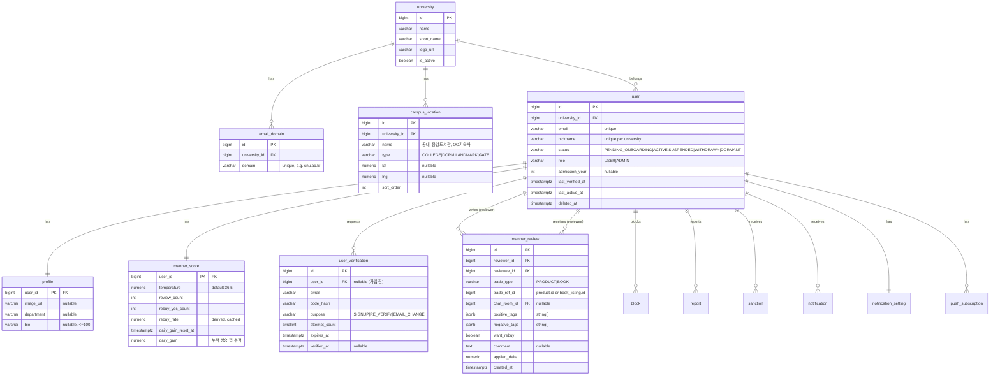
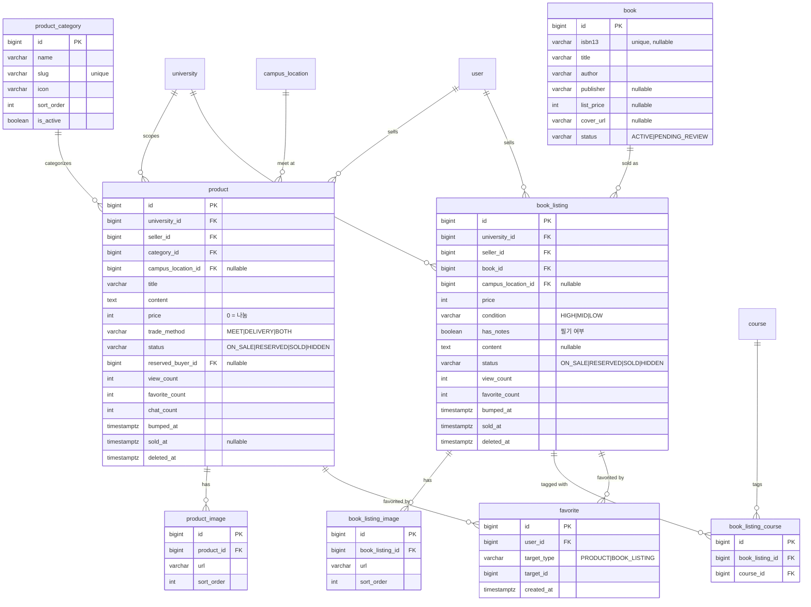
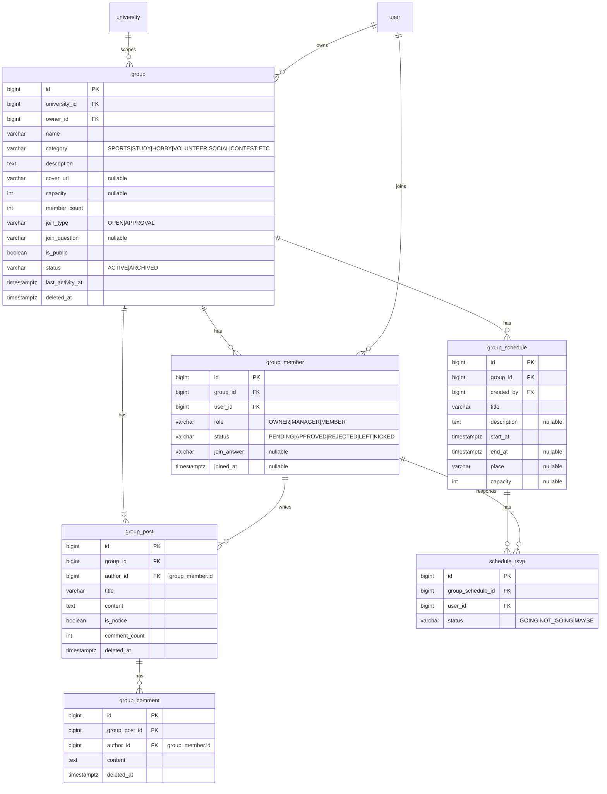
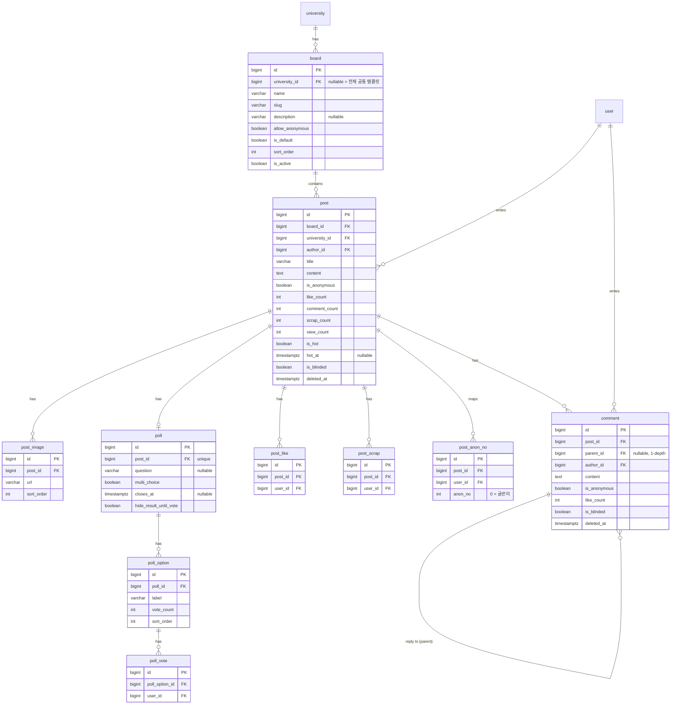
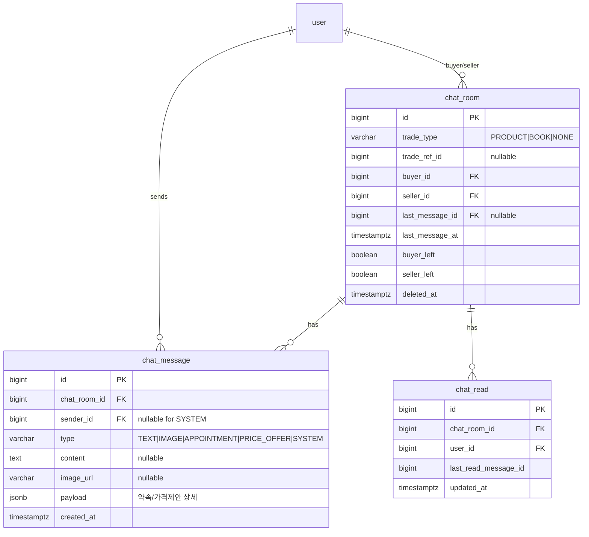
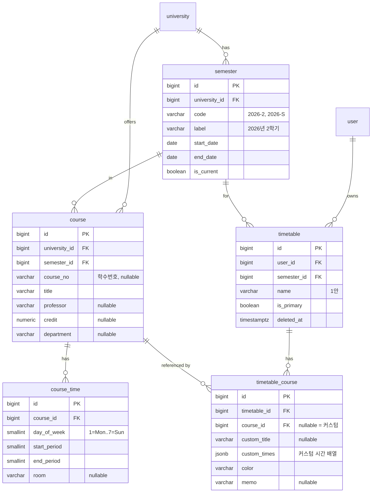

# 03. 데이터 모델 (ERD) — 당타(DangTa)

- DB: PostgreSQL 15+
- PK: `BIGINT` `id` (IDENTITY). 필요 시 외부노출용 `public_id UUID`.
- 공통 audit 컬럼: `created_at TIMESTAMPTZ NOT NULL DEFAULT now()`, `updated_at TIMESTAMPTZ NOT NULL DEFAULT now()`
- soft delete: `deleted_at TIMESTAMPTZ NULL` (있는 테이블만 표기)
- 문자열 기본: `VARCHAR` 길이 명시, 본문류는 `TEXT`
- 금액: `INTEGER` (원 단위), 온도: `NUMERIC(4,1)`
- ENUM은 애플리케이션 레벨 `VARCHAR` + CHECK 제약 (마이그레이션 유연성)

---

## 1. 전체 ERD

> 가독성을 위해 도메인별로 나눠 그린다. FK는 `id` 참조.

### 1.1 사용자 · 대학 · 신뢰

### 1.2 중고거래 · 중고책

### 1.3 소모임

### 1.4 커뮤니티

### 1.5 채팅

### 1.6 시간표

### 1.7 알림 · 신고 · 제재

```mermaid
erDiagram
    user ||--o{ notification : receives
    user ||--|| notification_setting : has
    user ||--o{ push_subscription : has
    user ||--o{ report : files
    user ||--o{ block : creates
    user ||--o{ sanction : receives

    notification {
        bigint id PK
        bigint user_id FK
        varchar category "CHAT|TRADE|COMMUNITY|GROUP|SYSTEM"
        varchar type "세부 이벤트 키"
        varchar title
        varchar body
        varchar link "딥링크 path"
        jsonb data
        timestamptz read_at "nullable"
        timestamptz created_at
    }
    notification_setting {
        bigint user_id PK "FK"
        boolean chat
        boolean trade
        boolean community
        boolean group
        boolean system
        boolean push_enabled
        boolean email_enabled
    }
    push_subscription {
        bigint id PK
        bigint user_id FK
        varchar endpoint "unique"
        varchar p256dh
        varchar auth
        varchar user_agent
        timestamptz created_at
    }
    report {
        bigint id PK
        bigint reporter_id FK
        varchar target_type "USER|PRODUCT|BOOK_LISTING|POST|COMMENT|GROUP|CHAT_MESSAGE"
        bigint target_id
        varchar reason "SCAM|ABUSE|SPAM|ADULT|PRIVACY|ETC"
        text detail "nullable"
        varchar status "PENDING|REVIEWING|ACTIONED|DISMISSED"
        bigint handled_by FK "nullable"
        text handle_memo "nullable"
        timestamptz created_at
        timestamptz handled_at "nullable"
    }
    block {
        bigint id PK
        bigint blocker_id FK
        bigint blocked_id FK
        timestamptz created_at
    }
    sanction {
        bigint id PK
        bigint user_id FK
        varchar type "WARN|WRITE_BAN|SUSPEND|PERMA_BAN"
        text reason
        bigint report_id FK "nullable"
        timestamptz starts_at
        timestamptz ends_at "nullable"
        bigint created_by FK
    }
```

---

## 2. 주요 인덱스

| 테이블 | 인덱스 | 목적 |
|---|---|---|
| user | `unique(email)`, `unique(university_id, nickname)`, `(university_id, status)` | 로그인/닉네임/목록 |
| email_domain | `unique(domain)` | 도메인 → 대학 매칭 |
| user_verification | `(email, purpose, created_at desc)` | 최신 코드 조회 |
| product | `(university_id, status, bumped_at desc)`, `(category_id, status, bumped_at desc)`, `(seller_id)` | 피드/필터 |
| product | GIN `to_tsvector(title || content)` 또는 `pg_trgm(title)` | 검색 |
| favorite | `unique(user_id, target_type, target_id)` | 중복 찜 방지 |
| book | `unique(isbn13)` | 도서 중복 방지 |
| book_listing | `(university_id, status, bumped_at desc)`, `(book_id)` | 피드 / 도서별 매물 |
| book_listing_course | `(course_id)`, `unique(book_listing_id, course_id)` | 강의로 교재 찾기 |
| group | `(university_id, status, last_activity_at desc)`, `(category)` | 탐색 |
| group_member | `unique(group_id, user_id)`, `(user_id, status)`, `(group_id, status)` | 내 모임 / 승인 큐 |
| post | `(board_id, deleted_at, created_at desc)`, `(university_id, is_hot, hot_at desc)`, `(author_id)` | 목록 / 핫게 |
| post_like | `unique(post_id, user_id)` | 중복 좋아요 방지 |
| post_scrap | `unique(post_id, user_id)` | 스크랩 목록 |
| post_anon_no | `unique(post_id, user_id)`, `unique(post_id, anon_no)` | 익명번호 |
| comment | `(post_id, created_at)`, `(parent_id)` | 댓글 트리 |
| chat_room | `unique(trade_type, trade_ref_id, buyer_id, seller_id)`, `(buyer_id, last_message_at desc)`, `(seller_id, last_message_at desc)` | 방 중복 방지 / 목록 |
| chat_message | `(chat_room_id, id)` | 메시지 페이징 |
| chat_read | `unique(chat_room_id, user_id)` | 읽음 상태 |
| course | `(university_id, semester_id)`, `(university_id, semester_id, title)` , trigram(title/professor) | 강의 검색 |
| timetable | `(user_id, semester_id)`, `unique(user_id, semester_id, is_primary) where is_primary` | 대표 시간표 |
| notification | `(user_id, read_at, created_at desc)` | 알림함 |
| report | `(status, created_at)`, `(target_type, target_id)` | 신고 큐 |
| block | `unique(blocker_id, blocked_id)` | 차단 |
| sanction | `(user_id, ends_at)` | 활성 제재 확인 |

---

## 3. ENUM / 코드값 정리

| 도메인 | 필드 | 값 |
|---|---|---|
| user.status | | PENDING_ONBOARDING, ACTIVE, SUSPENDED, WITHDRAWN, DORMANT |
| user.role | | USER, ADMIN |
| product.status / book_listing.status | | ON_SALE, RESERVED, SOLD, HIDDEN |
| product.trade_method | | MEET, DELIVERY, BOTH |
| book_listing.condition | | HIGH, MID, LOW |
| campus_location.type | | COLLEGE, DORM, LANDMARK, GATE |
| group.category | | SPORTS, STUDY, HOBBY, VOLUNTEER, SOCIAL, CONTEST, ETC |
| group.join_type | | OPEN, APPROVAL |
| group_member.role | | OWNER, MANAGER, MEMBER |
| group_member.status | | PENDING, APPROVED, REJECTED, LEFT, KICKED |
| schedule_rsvp.status | | GOING, NOT_GOING, MAYBE |
| chat_room.trade_type / manner_review.trade_type | | PRODUCT, BOOK, NONE |
| chat_message.type | | TEXT, IMAGE, APPOINTMENT, PRICE_OFFER, SYSTEM |
| notification.category | | CHAT, TRADE, COMMUNITY, GROUP, SYSTEM |
| report.target_type | | USER, PRODUCT, BOOK_LISTING, POST, COMMENT, GROUP, CHAT_MESSAGE |
| report.reason | | SCAM, ABUSE, SPAM, ADULT, PRIVACY, ETC |
| report.status | | PENDING, REVIEWING, ACTIONED, DISMISSED |
| sanction.type | | WARN, WRITE_BAN, SUSPEND, PERMA_BAN |
| manner_review.positive_tags | | KIND, ON_TIME, GOOD_ITEM, FAST_REPLY, GENEROUS |
| manner_review.negative_tags | | NO_SHOW, RUDE, ITEM_DIFF, SLOW_REPLY, CANCELLED |

---

## 4. 설계 노트

- **university 스코프**: 대부분의 도메인 테이블에 `university_id`를 비정규화로 들고 있어 "같은 학교" 필터를 조인 없이 처리한다. 작성자의 대학이 바뀔 일은 거의 없음(전학 시 관리자 처리).
- **favorite / report**: 다형(polymorphic) `target_type + target_id`. FK 제약 대신 애플리케이션 무결성 + 배치 정합성 체크.
- **집계 컬럼**(view_count, like_count, member_count 등): 정확성보다 성능. 이벤트로 증감, 주기적 재계산 배치.
- **매너온도 계산**: `manner_score`를 단일 소스로. 리뷰 생성 트랜잭션에서 `applied_delta` 확정 후 `temperature` 갱신, 일일 상승 캡은 `daily_gain` + `daily_gain_reset_at`으로.
- **채팅방 유일성**: `unique(trade_type, trade_ref_id, buyer_id, seller_id)`로 같은 상품·같은 상대 방 재생성 방지. `trade_type=NONE`(일반 채팅)은 이 제약에서 제외하거나 partial unique.
- **익명번호**: 글 최초 진입(댓글/글) 시 `post_anon_no` upsert. 경쟁 조건은 `unique(post_id, anon_no)` + 재시도.
- **핫게시판**: 배치(예: 5분)로 최근 24h 윈도우 스코어 계산 → `is_hot`, `hot_at` 갱신. 하루 지나면 자동 해제.
- **강의/학기 마스터**: 학교별 수강편람 CSV 업로드로 시딩. 없으면 사용자가 커스텀(`timetable_course.custom_*`).
