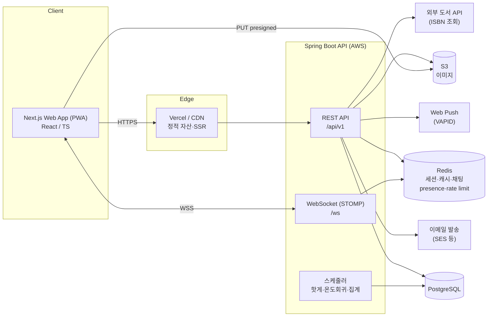
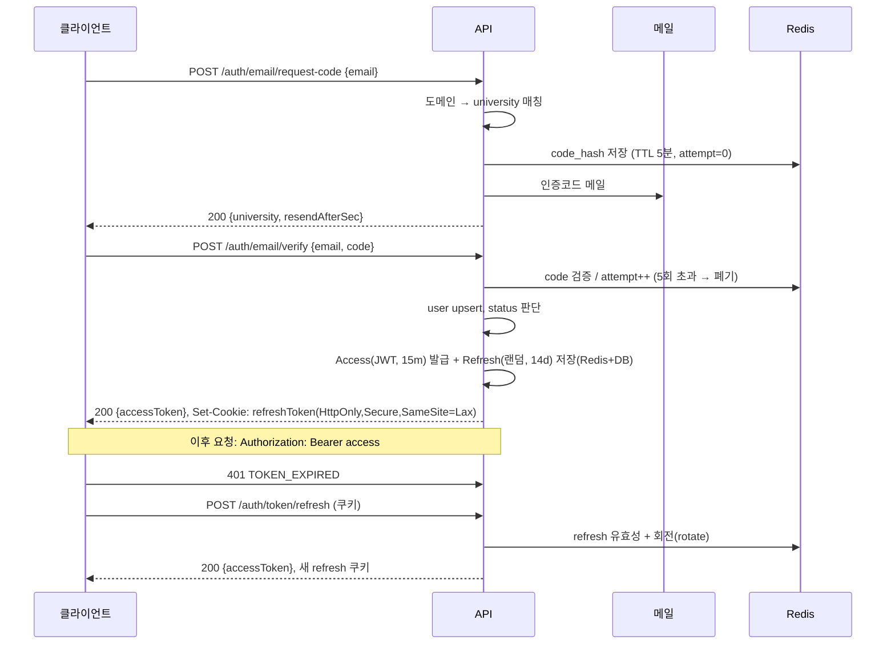

# 05. 시스템 · 코드 구조 — 당타(DangTa)

## 1. 시스템 아키텍처



### 배포 개요
- **프론트**: Vercel (Next.js App Router, SSR/ISR). 환경별 프리뷰.
- **백엔드**: AWS (ECS Fargate 또는 EC2) + ALB. 컨테이너 이미지.
- **DB**: RDS PostgreSQL (Multi-AZ), 자동 백업.
- **Redis**: ElastiCache.
- **이미지**: S3 + CloudFront. 업로드는 presigned PUT.
- **WebSocket**: ALB(WebSocket 지원) → Spring. 다중 인스턴스 시 Redis Pub/Sub 또는 STOMP relay로 브로드캐스트.
- **CI/CD**: GitHub Actions (test → build → deploy).

---

## 2. 인증 흐름 (시퀀스)



- Access: JWT (sub=userId, uni=universityId, role). 무상태 검증.
- Refresh: opaque 토큰, 회전(rotation) + 재사용 탐지 시 전체 무효화.
- 로그아웃: refresh 폐기. `logout-all`: 사용자 refresh 전체 폐기.
- 제재/미인증 체크: 매 요청 시 경량 필터 (Redis 캐시된 user status).

---

## 3. 프론트엔드 구조 (Next.js App Router)

```
web/
├─ app/
│  ├─ (auth)/login/…              # 인증 전 라우트
│  ├─ (main)/
│  │  ├─ layout.tsx               # 하단 탭바 + 상단 앱바
│  │  ├─ page.tsx                 # 홈 = 중고거래 피드
│  │  ├─ products/[id]/page.tsx
│  │  ├─ products/new/page.tsx
│  │  ├─ books/…
│  │  ├─ groups/…
│  │  ├─ community/[board]/…
│  │  ├─ community/posts/[id]/…
│  │  └─ my/…                      # 마이, 시간표
│  ├─ chat/…                       # 탭 밖
│  └─ share/timetables/[token]/…   # 공개 읽기전용
├─ features/                       # 도메인별 응집
│  ├─ auth/       (api, hooks, components, store)
│  ├─ product/
│  ├─ book/
│  ├─ group/
│  ├─ community/
│  ├─ chat/       (stompClient, hooks)
│  ├─ timetable/
│  └─ manner/
├─ components/ui/                  # 디자인 시스템 (Button, Chip, Sheet…)
├─ lib/
│  ├─ apiClient.ts                 # fetch 래퍼, 토큰 refresh 인터셉터
│  ├─ queryClient.ts               # TanStack Query
│  └─ push.ts                      # Web Push 등록
├─ store/                          # Zustand (전역: auth, unreadCounts)
├─ styles/                         # Tailwind config, 토큰
└─ public/ (manifest.json, sw.js, icons)
```

- 데이터 패칭: **TanStack Query** (서버 상태), **Zustand** (auth/unread 등 소량 전역).
- 스타일: **Tailwind** + CSS 변수 토큰 (06 문서). 컴포넌트는 `components/ui`.
- 모바일 우선, 최대 폭 제한(예: 480px) 중앙 정렬 레이아웃 + PWA(설치, 오프라인 셸).
- 실시간: `features/chat/stompClient.ts` (`@stomp/stompjs` + SockJS), 화면 진입 시 구독/해제.

---

## 4. 백엔드 구조 (Spring Boot, 도메인형 패키지)

```
api/
└─ src/main/java/app/dangta/
   ├─ DangtaApplication.java
   ├─ common/
   │  ├─ config/        (Security, Web, WebSocket, Redis, S3, Jpa)
   │  ├─ web/           (공통 응답, 예외 핸들러 @RestControllerAdvice)
   │  ├─ security/      (JWT 필터, CurrentUser, 인증/제재 가드)
   │  ├─ pagination/    (커서 인코딩 유틸)
   │  └─ storage/       (Presign 서비스)
   ├─ university/       (University, EmailDomain, CampusLocation)
   ├─ auth/             (VerificationCode, TokenService, AuthController)
   ├─ user/             (User, Profile, MannerScore, MannerReview)
   ├─ product/          (Product, ProductImage, Category, Favorite)
   ├─ book/             (Book, BookListing, BookListingCourse)
   ├─ group/            (Group, GroupMember, GroupPost, GroupSchedule)
   ├─ community/        (Board, Post, Comment, Poll, AnonNoService)
   ├─ chat/             (ChatRoom, ChatMessage, ChatRead, StompController)
   ├─ timetable/        (Semester, Course, Timetable)
   ├─ notification/     (Notification, PushSubscription, Notifier)
   ├─ report/           (Report, Block, Sanction)
   ├─ search/           (SearchController → 도메인 서비스 조합)
   ├─ admin/            (Admin* Controllers)
   └─ batch/            (HotPostJob, MannerDecayJob, CounterReconcileJob)
```

- 계층: `Controller → Service → Repository(JPA)` . DTO는 도메인 패키지 내 `dto/`.
- 트랜잭션: 서비스 레이어 `@Transactional`. 집계 컬럼 증감은 원자적 update 쿼리.
- 이벤트: 도메인 이벤트(`@TransactionalEventListener`)로 알림 발송·집계 트리거 분리.
- 인증: `OncePerRequestFilter`에서 JWT 파싱 → `SecurityContext`. `@CurrentUser` 파라미터 리졸버.
- 가드: `@RequireActive`, `@RequireNotBanned` 커스텀 애노테이션 + AOP 또는 인터셉터.

---

## 5. 실시간 · 캐시 전략 (Redis 사용처)

| 용도 | 키/구조 | 비고 |
|---|---|---|
| 인증코드 | `verify:{email}:{purpose}` → hash{codeHash, attempt} | TTL 5분 |
| Refresh 토큰 | `refresh:{tokenId}` → userId | TTL 14일, 회전 |
| user status 캐시 | `user:status:{id}` | 제재/탈퇴 빠른 반영, TTL 짧게 |
| rate limit | `rl:{action}:{userId}` (INCR + EXPIRE) | 분당 상한 |
| 채팅 presence | `room:{id}:online` (set) | 미접속자 → 푸시 |
| 채팅 브로드캐스트 | Redis Pub/Sub `chat.room.{id}` | 다중 인스턴스 |
| 미읽음 카운트 | `unread:{userId}` | DB 폴백 |
| 인기/핫 캐시 | `hot:posts:{universityId}` | 배치 결과 캐시 |

---

## 6. 환경변수

**백엔드**
```
SPRING_PROFILES_ACTIVE=prod
DB_URL / DB_USERNAME / DB_PASSWORD
REDIS_HOST / REDIS_PORT
JWT_SECRET / JWT_ACCESS_TTL=900 / JWT_REFRESH_TTL=1209600
MAIL_PROVIDER / MAIL_FROM / SES_REGION (or SMTP_*)
S3_BUCKET / S3_REGION / AWS_ACCESS_KEY_ID / AWS_SECRET_ACCESS_KEY / CDN_BASE_URL
WEB_PUSH_VAPID_PUBLIC / WEB_PUSH_VAPID_PRIVATE / WEB_PUSH_SUBJECT
BOOK_API_BASE / BOOK_API_KEY
CORS_ALLOWED_ORIGINS=https://dangta.app
```

**프론트엔드**
```
NEXT_PUBLIC_API_BASE=https://api.dangta.app
NEXT_PUBLIC_WS_BASE=wss://api.dangta.app/ws
NEXT_PUBLIC_WEB_PUSH_VAPID_PUBLIC=...
```

---

## 7. 로컬 개발 셋업 (개요)

```
# 인프라
docker compose up -d        # postgres, redis, mailhog(메일 확인), minio(S3 대체)

# 백엔드
cd api && ./gradlew bootRun   # http://localhost:8080

# 프론트
cd web && pnpm install && pnpm dev   # http://localhost:3000
```

- `mailhog` 로 인증코드 메일 확인 (http://localhost:8025)
- `minio` 로 presigned 업로드 테스트
- 시드 스크립트: 대학 1곳 + 캠퍼스 위치 + 기본 게시판 + 샘플 강의(CSV)

---

## 8. 비기능 요구 (요약)

| 항목 | 목표 |
|---|---|
| 응답시간 | 목록 API p95 < 300ms |
| 이미지 | 업로드 원본 10MB 제한, 서버/CDN 리사이즈 |
| 보안 | 전 구간 HTTPS, JWT 짧은 TTL, refresh 회전, CORS 화이트리스트, SQL 파라미터 바인딩, 이미지 EXIF 제거 |
| 개인정보 | 이메일만 수집, 탈퇴 시 파기/익명화, 접근 로그 |
| 접근성 | 색 대비 AA, 터치 타겟 44px, 스크린리더 레이블 |
| 관측성 | 구조화 로깅, 에러 추적(Sentry 등), 기본 메트릭 |
| 백업 | RDS 자동 백업 + PITR |
