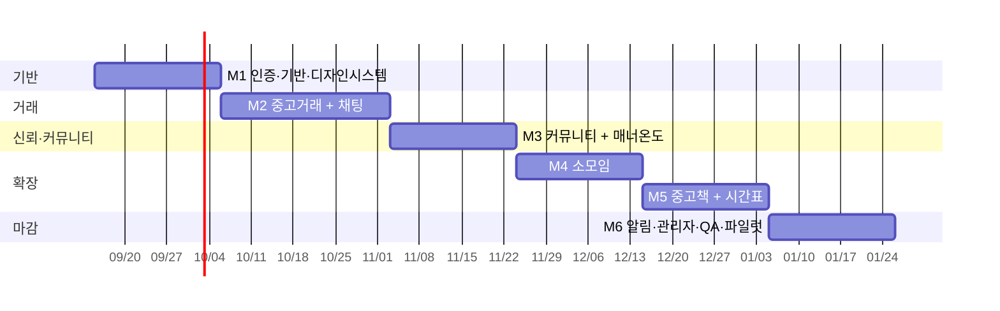

# 07. 개발 로드맵 — 당타(DangTa)

> v1 목표: **1개 대학 파일럿 런칭** (학기 시작 시즌에 맞춰). 전체 도메인 포함하되 마일스톤 순서로 쌓는다.

---

## 마일스톤 개요

---

## M1 — 인증 · 기반 · 디자인 시스템 (약 3주)

**목표**: 로그인하면 빈 홈까지 들어온다.

| 포함 | 상세 |
|---|---|
| 기능 | AUTH-1~5, AUTH-8, PROF-1, 온보딩 |
| API | `/auth/*`, `/universities/resolve`, `/me`, `/me/onboarding`, `/me/profile`, `/uploads/presign` |
| 테이블 | university, email_domain, campus_location, user, profile, user_verification, manner_score(초기값) |
| 프론트 | 디자인 시스템(`components/ui`), 레이아웃(탭바/앱바), apiClient + refresh 인터셉터, 로그인/온보딩 플로우 |
| 인프라 | docker-compose(pg/redis/mailhog/minio), CI, 배포 파이프라인, 시드 스크립트 |

**완료 기준**: 학교 이메일로 가입 → 온보딩 → 홈 진입. 토큰 만료 시 자동 갱신.
**리스크**: 이메일 도메인 매핑 데이터 확보, 메일 전달률.

---

## M2 — 중고거래 + 채팅 (약 4주)

**목표**: 물건을 올리고, 채팅하고, 거래완료까지.

| 포함 | 상세 |
|---|---|
| 기능 | PROD-1~10, CHAT-1~10, 이미지 업로드, SRCH-2(상품 검색) |
| API | `/products/*`, `/favorites`, `/product-categories`, `/chat/*`, STOMP `/ws` |
| 테이블 | product, product_image, product_category, favorite, chat_room, chat_message, chat_read |
| 프론트 | 홈 피드/필터, 상품 상세/등록/수정, 찜, 채팅 목록/방(STOMP), 약속잡기, 거래완료 |
| 배치 | 조회수/찜수 집계 정합성 잡 |

**완료 기준**: 두 계정으로 상품 등록 → 채팅 → 약속 → 거래완료(SOLD).
**리스크**: WebSocket 다중 인스턴스 브로드캐스트, 채팅방 유일성 경쟁조건.

---

## M3 — 커뮤니티 + 매너온도 (약 3주)

**목표**: 학교 게시판이 돌아가고, 거래 후 평가로 온도가 움직인다.

| 포함 | 상세 |
|---|---|
| 기능 | COMM-1~8, COMM-11, TEMP-2~7, PROF-2, SRCH-2(글) |
| API | `/boards`, `/posts/*`, `/comments/*`, `/posts/hot`, `/manner/*`, `/users/{id}`, `/users/{id}/manner-reviews` |
| 테이블 | board, post, post_image, comment, post_like, post_scrap, post_anon_no, manner_review |
| 프론트 | 게시판/글목록/상세/작성, 댓글 트리, 익명 표기, 핫게 탭, 매너 평가 카드, 프로필 화면 |
| 배치 | HotPostJob(5분), 매너온도 일일 캡 리셋 |

**완료 기준**: 익명 글/댓글 작성, 좋아요·스크랩, 핫게 등극. 거래완료 → 평가 → 온도 변동 확인.

---

## M4 — 소모임 (약 3주)

| 포함 | 상세 |
|---|---|
| 기능 | GRP-1~10 |
| API | `/groups/*`, `/group-categories`, `/me/groups` |
| 테이블 | group, group_member, group_post, group_comment, group_schedule, schedule_rsvp |
| 프론트 | 모임 탐색/상세/개설, 가입 신청·승인 관리, 모임 게시판, 일정 + RSVP |

**완료 기준**: 승인제 모임 개설 → 신청 → 승인 → 모임 게시판·일정 사용.

---

## M5 — 중고책 + 시간표 (약 3주)

| 포함 | 상세 |
|---|---|
| 기능 | BOOK-1~8, TT-1~7, TT-8(연동) |
| API | `/books/*`, `/book-listings/*`, `/semesters`, `/courses/*`, `/timetables/*`, `/courses/{id}/book-listings` |
| 테이블 | book, book_listing, book_listing_image, book_listing_course, semester, course, course_time, timetable, timetable_course |
| 프론트 | 중고책 탭/검색/등록(ISBN)/상세, 강의로 교재 찾기, 시간표 그리드/강의 검색/공유 |
| 데이터 | 외부 도서 API 연동, 파일럿 대학 수강편람 CSV import |

**완료 기준**: ISBN으로 책 등록 → 강의 태그 → 시간표에서 강의 담고 "교재 보기" 딥링크 동작.

---

## M6 — 알림 · 관리자 · QA · 파일럿 (약 3주)

| 포함 | 상세 |
|---|---|
| 기능 | NOTI-1~4, RPT-1~4, SRCH-1(통합), 관리자 전 영역, AUTH-6(재인증), AUTH-7(탈퇴) |
| API | `/notifications/*`, `/push/subscriptions`, `/reports`, `/blocks`, `/search`, `/admin/*` |
| 테이블 | notification, notification_setting, push_subscription, report, block, sanction |
| 작업 | 웹푸시(VAPID), 알림 이벤트 배선(각 도메인), 관리자 웹, 통합 검색, PWA manifest/서비스워커, QA·버그픽스, 성능 점검, 파일럿 대학 온보딩·홍보 |

**완료 기준**: 주요 이벤트 알림 수신, 신고→관리자 처리→제재 반영, 앱 설치(PWA), 파일럿 런칭.

---

## v1.1 이후 백로그 (우선순위 순)

1. 다크 모드
2. 개인화 피드(추천), 검색 엔진 도입(OpenSearch)
3. 검색어 알림(키워드 알림, SRCH-4)
4. 모임 그룹 채팅(GRP-8)
5. 안전결제/에스크로 검토
6. 네이티브 앱(RN/Expo) 또는 PWA 고도화
7. 강의평가 정식 기능
8. 빈 시간 겹치기(TT-9), 되팔기 자동완성(BOOK-8)
9. 배지/게이미피케이션(PROF-4)
10. 다중 대학 확장, 대학 간 정책

---

## 진행 관리

- 이슈 트래킹: 기능 ID(예: `PROD-6`)를 이슈 라벨로 사용 → 02 문서와 1:1 추적.
- 각 마일스톤 종료 시: 02/03/04 문서와 실제 구현 diff 리뷰 → 문서 갱신(문서가 소스 오브 트루스).
- 데모 계정 2개 상시 유지(구매자/판매자 시나리오 회귀 테스트).
