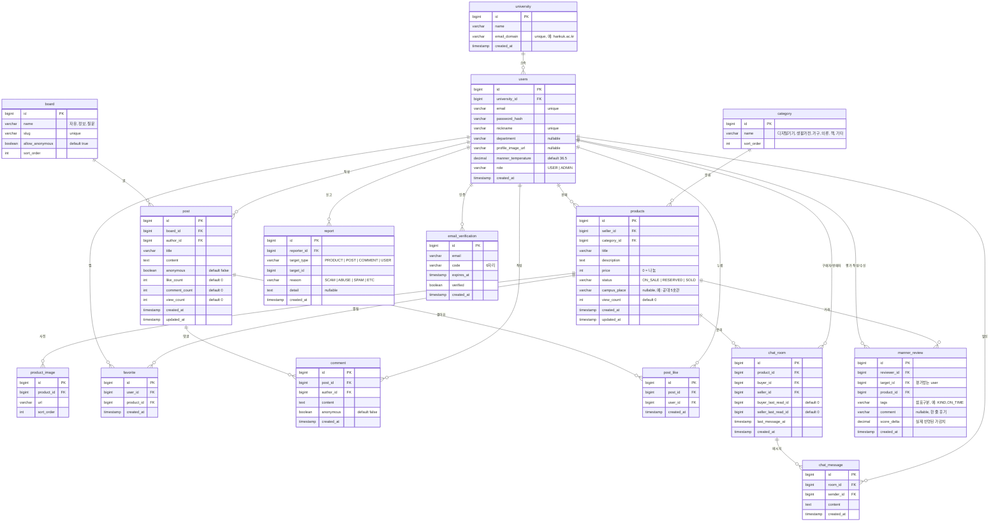

# MVP 데이터 모델 (ERD)

- 15개 테이블. 전체 기획(`docs/03-erd.md` 40여 개)에서 필요한 것만.
- PK: `BIGINT id` auto increment.
- 공통: `created_at`, 수정 잦은 테이블만 `updated_at`.
- soft delete 안 씀 → 삭제는 실제 DELETE (신고 대비 로그가 필요하면 나중에).
- ENUM은 `VARCHAR` + 애플리케이션 상수 (JPA `@Enumerated(EnumType.STRING)`).
- 금액은 `INT`(원), 온도는 `DECIMAL(4,1)`.

---

## 1. ERD



---

## 2. 테이블 정의 (요점)

### university
학교 목록. 시드로 **1개만** 넣는다.
- `email_domain` unique. 가입 시 이메일에서 `@` 뒤를 잘라 매칭.

### email_verification
개발 모드에서는 실제 메일을 보내지 않고, 코드 발송 API 응답에 코드를 같이 내려준다.
- 한 이메일에 여러 행 가능. 검증 시 가장 최근 행 + `expires_at > now` + `code` 일치 확인.
- 유효기간 예: 10분.

### users
프로필과 매너온도를 **한 테이블에** 둔다(분리 안 함 — 단순화).
- `password_hash`: BCrypt.
- `nickname` unique (전체에서. MVP는 학교 1개라 학교별 unique와 동일).
- `manner_temperature` 기본값 `36.5`.
- `role` 기본 `USER`. 관리자는 DB에서 직접 `ADMIN`으로.

### category
시드로 6개: 디지털기기 / 생활가전 / 가구·인테리어 / 의류 / 책 / 기타.
→ **"책"이 중고책 대체**. 별도 도서 테이블 없음.

### products
- `status` 전이: `ON_SALE → RESERVED → SOLD` (되돌리기 허용). 잘못된 전이는 서비스에서 예외.
- `campus_place`는 그냥 문자열(선택). 장소 마스터 테이블 없음.
- `view_count`는 상세 조회 시 +1 (중복 방지 안 함 — 단순화).
- 이미지 개수 1~3장 권장(제한은 앱에서).

### product_image
상품 1 : N 이미지. `url`은 업로드 API가 돌려준 경로.

### favorite
`unique(user_id, product_id)`. 찜 개수는 필요하면 `count(*)`로.

### board
시드로 3개: 자유 / 정보 / 질문. `slug`로 URL (`/community/free`).

### post
- `anonymous`가 true면 응답에서 작성자 이름을 "익명"으로. **익명 번호(익명1, 익명2)는 MVP에서 생략.** 단, 글 작성자 본인이 자기 글에 익명 댓글을 달면 "익명(글쓴이)"로 구분 표시 (댓글의 `author_id == post.author_id` 비교만 하면 됨).
- `like_count`, `comment_count`는 좋아요/댓글 추가·삭제 시 증감(비정규화). 처음엔 `count(*)`로 해도 됨.

### comment
1단계만 (대댓글 없음, `parent_id` 없음).

### post_like
`unique(post_id, user_id)`. 토글.

### chat_room
1:1 전용. `unique(product_id, buyer_id)`로 같은 상품·같은 구매자 방 중복 방지.
- 판매자는 `product.seller_id`와 동일.
- 안읽음 수 = `chat_message` 중 `id > (내가 buyer면 buyer_last_read_id 아니면 seller_last_read_id)` AND `sender_id != 나` 의 개수.
- `last_message_at`으로 채팅 목록 정렬.

### chat_message
텍스트만. 이미지·시스템 메시지 없음. 폴링으로 읽음: `GET .../messages?afterId=` 로 새 것만 가져옴.

### manner_review
- `unique(reviewer_id, product_id)` — 한 거래에 한 번만 평가.
- `tags`: 긍정 태그 코드들을 쉼표로. 예 `KIND,ON_TIME,FAST_REPLY`.
- `comment`: 한 줄 후기(선택). 상대 프로필에 노출.
- 온도 계산(§3)을 서비스에서 하고 결과 `score_delta` 저장, 동시에 `users.manner_temperature` 갱신.

### report
그냥 값만 저장(관리자 처리 없음). `target_type` + `target_id` 문자열/숫자, FK 제약 없음.

---

## 3. 매너온도 계산 (MVP 고정 규칙)

거래완료 후 상대를 평가하면:

```
긍정 태그: KIND(친절), ON_TIME(시간약속), GOOD_ITEM(상품좋음), FAST_REPLY(응답빠름), GENEROUS(좋은나눔)

score_delta = 선택한 긍정 태그 수 × 0.5   (최대 +2.0, 태그 0개면 0)
new_temp    = min(99.0, users.manner_temperature + score_delta)
```

- 부정 평가는 MVP에서 생략(신고로 대체). 필요하면 `BAD` 태그 하나만 두고 −1.0.
- 같은 상대 반복 거래 제한 등도 생략.
- 이 규칙을 `MannerScorePolicy` 인터페이스 + 구현체로 빼두면 OOP 수업 평가에 유리 (`docs/08` §7).

---

## 4. 시드 데이터 (앱 시작 시 자동 삽입)

| 테이블 | 내용 |
|---|---|
| university | 1개 (예: 한국대학교 / hankuk.ac.kr) |
| category | 6개 |
| board | 3개 (자유·정보·질문) |
| users | 테스트 계정 2~3개 (구매자/판매자 시연용) |
| products | 5~10개 (피드가 비어 보이지 않게) |
| post | 3~5개 |

`data.sql` 또는 `CommandLineRunner`로.

---

## 5. 인덱스 (최소)

| 테이블 | 인덱스 |
|---|---|
| users | `unique(email)`, `unique(nickname)` |
| university | `unique(email_domain)` |
| products | `(status, created_at desc)`, `(category_id)`, `(seller_id)` |
| favorite | `unique(user_id, product_id)` |
| post | `(board_id, created_at desc)` |
| post_like | `unique(post_id, user_id)` |
| comment | `(post_id, created_at)` |
| chat_room | `unique(product_id, buyer_id)`, `(buyer_id)`, `(seller_id)` |
| chat_message | `(room_id, id)` |
| manner_review | `unique(reviewer_id, product_id)` |

검색(`products.title` LIKE)은 MVP 규모(수백~수천 건)에서 인덱스 없이도 충분.
